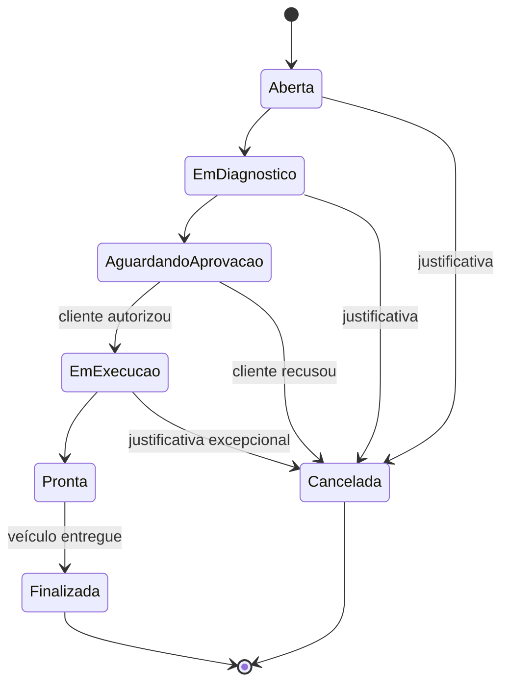
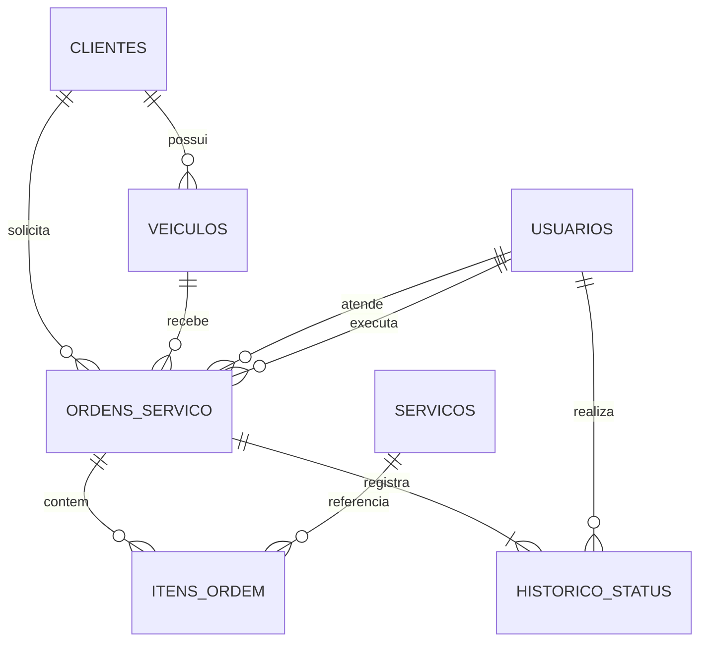
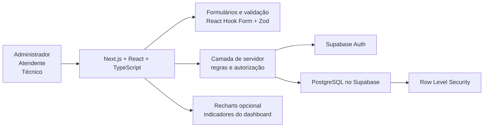

# Especificação de design — Sistema Mundo Ar Climatização

Data: 31 de agosto de 2026  
Status: desenho arquitetural aprovado para planejamento  
Modalidade: sistema web desktop-first

## 1. Objetivo

Desenvolver um sistema web para apoiar as atividades da oficina automotiva Mundo Ar Climatização. O sistema centralizará o cadastro de clientes, veículos e serviços; controlará a ordem de serviço desde a entrada do veículo até a entrega; e fornecerá relatórios operacionais e históricos.

O projeto deve ser utilizável pela empresa real e, simultaneamente, atender ao escopo acadêmico mínimo do Estágio Supervisionado I: três cadastros, um processo e três relatórios.

As regras descritas neste documento constituem a versão preliminar aprovada. O levantamento presencial com a oficina poderá refiná-las, mas qualquer alteração deverá ser registrada como mudança de requisito para preservar a rastreabilidade do TCC.

## 2. Escopo da primeira versão

### 2.1 Incluído

- Autenticação e controle de acesso por perfil.
- Dashboard operacional.
- Cadastro de clientes.
- Cadastro de veículos vinculados aos clientes.
- Cadastro de serviços e valores-base.
- Abertura e acompanhamento de ordens de serviço.
- Registro da reclamação do cliente e das condições de entrada.
- Diagnóstico técnico.
- Composição do orçamento com itens de serviço.
- Registro da autorização ou recusa do cliente.
- Execução, conclusão e entrega do veículo.
- Registro resumido da forma de pagamento na ordem.
- Histórico de mudanças de status.
- Relatório de ordens por período.
- Relatório de serviços mais realizados.
- Histórico de manutenção por veículo.
- Impressão das consultas e relatórios essenciais.

### 2.2 Adiado

- Anexos e fotografias com Supabase Storage.
- Atualizações instantâneas com Supabase Realtime.
- Notificações automáticas por WhatsApp, SMS ou e-mail.
- Agenda de atendimentos.
- Garantias detalhadas.

### 2.3 Fora do escopo

- Estoque e movimentação de peças.
- Compras e fornecedores.
- Contas a pagar e a receber.
- Emissão fiscal.
- Folha de pagamento.
- Aplicativo móvel nativo.
- Mapas, trajetos, geocercas, MapLibre ou PostGIS.

## 3. Atores e permissões

### 3.1 Administrador

Representa o proprietário ou responsável. Possui acesso completo, administra usuários, clientes, veículos, serviços, valores, ordens e relatórios. Pode corrigir uma transição de status, desde que informe uma justificativa.

### 3.2 Atendente

Cadastra e consulta clientes e veículos; abre ordens; registra autorizações; acompanha o andamento; prepara a entrega; e consulta relatórios operacionais. Pode consultar serviços, mas não administra usuários nem altera as regras globais.

### 3.3 Técnico

Consulta os dados necessários da ordem, do cliente e do veículo; registra diagnóstico; informa serviços executados; e conclui a etapa técnica. Não acessa a administração de usuários nem os relatórios gerenciais na primeira versão.

O cliente não é ator direto porque não acessará o sistema nesta versão. Sua autorização será registrada por um funcionário.

## 4. Módulos

1. **Acesso e usuários:** login, encerramento da sessão, perfil e administração de contas.
2. **Dashboard:** indicadores por status, ordens recentes, pendências e atalhos.
3. **Clientes:** inclusão, consulta, alteração e inativação.
4. **Veículos:** inclusão, consulta, alteração, inativação e vínculo com cliente.
5. **Serviços:** catálogo, categoria, descrição, valor-base e situação.
6. **Ordens de serviço:** entrada, diagnóstico, orçamento, autorização, execução, conclusão e entrega.
7. **Relatórios:** consultas por período, frequência de serviços e histórico do veículo.

Cada módulo terá limites claros: a interface coleta e apresenta dados; os serviços de aplicação aplicam as regras; e o acesso ao banco permanece isolado na camada de servidor.

## 5. Fluxo da ordem de serviço

### 5.1 Aberta

O atendente seleciona ou cadastra cliente e veículo e registra reclamação, quilometragem, data de entrada e observações. O sistema gera um número único para a ordem.

### 5.2 Em diagnóstico

O técnico registra testes, defeitos encontrados e recomendações. Os itens sugeridos para o orçamento podem ser adicionados a partir do cadastro de serviços, com possibilidade de ajustar descrição, quantidade e valor praticado.

### 5.3 Aguardando aprovação

O sistema calcula o total do orçamento. O atendente registra a decisão do cliente, data, responsável e meio de autorização: presencial, telefone ou WhatsApp. A recusa encerra a ordem como cancelada ou não autorizada, sem apagar o diagnóstico.

### 5.4 Em execução

Somente itens autorizados podem ser marcados como executados. O técnico registra observações da execução e a conclusão técnica.

### 5.5 Pronta

Todos os itens executados e valores são conferidos. A ordem aguarda retirada do veículo.

### 5.6 Finalizada

O atendente registra data e responsável pela entrega e a forma resumida de pagamento. A ordem se torna somente leitura para usuários comuns.

### 5.7 Regras de transição

- Usuários comuns seguem a sequência definida e não pulam etapas.
- O administrador pode corrigir o status mediante justificativa.
- Cada transição grava status anterior, novo status, usuário, data, hora e observação.
- O cancelamento exige motivo e não remove a ordem.
- Ordens finalizadas ou canceladas permanecem disponíveis para consulta e relatórios.

## 6. Modelo de dados conceitual

### 6.1 Entidades

| Entidade | Responsabilidade | Campos principais |
| --- | --- | --- |
| clientes | Identificar o proprietário ou responsável pelo veículo | id, nome, documento, telefone, e-mail, endereço, observações, ativo |
| veiculos | Manter os veículos vinculados aos clientes | id, cliente_id, placa, marca, modelo, ano, cor, combustível, observações, ativo |
| servicos | Formar o catálogo de serviços da oficina | id, nome, descrição, categoria, valor_base, ativo |
| usuarios | Complementar a conta do Supabase Auth com dados do funcionário | id_auth, nome, perfil, ativo, criado_em |
| ordens_servico | Representar todo o atendimento do veículo | id, numero, cliente_id, veiculo_id, atendente_id, tecnico_id, status, reclamação, diagnóstico, quilometragem, datas, totais, pagamento, observações |
| itens_ordem | Registrar serviços orçados, autorizados e executados | id, ordem_id, servico_id, descrição, quantidade, valor_unitario, subtotal, autorizado, executado |
| historico_status | Auditar o ciclo da ordem | id, ordem_id, usuario_id, status_anterior, status_novo, ocorrido_em, justificativa |

O item da ordem guarda sua própria descrição e seu valor. Assim, alterações futuras no catálogo de serviços não modificam ordens antigas. Clientes, veículos ou serviços que já participem de uma ordem serão inativados, não excluídos fisicamente.

## 7. Relatórios

### 7.1 Ordens por período

Filtros: data inicial, data final, status, cliente, veículo e técnico.  
Saída: número, datas, cliente, veículo, status, responsáveis e valor total.  
Resumo: quantidade de ordens e soma dos valores no período.

### 7.2 Serviços mais realizados

Filtros: data inicial, data final e categoria.  
Saída: serviço, quantidade de execuções e valor total associado.  
Ordenação padrão: maior quantidade para menor quantidade. Somente itens marcados como executados em ordens finalizadas entram no resultado.

### 7.3 Histórico de manutenção do veículo

Filtro principal: placa ou veículo.  
Saída: dados do veículo, datas, quilometragem, reclamação, diagnóstico, serviços executados, valores e situação da ordem.  
Ordenação padrão: atendimento mais recente primeiro.

Os três relatórios serão visualizados em tabela e terão versão apropriada para impressão. Exportação para planilha ou PDF poderá ser adicionada posteriormente, sem ser critério de aceite da primeira versão.

## 8. Arquitetura técnica

### 8.1 Tecnologias

| Camada | Tecnologia | Finalidade |
| --- | --- | --- |
| Frontend e servidor web | Next.js, React e TypeScript | Páginas, componentes, operações de servidor e regras da aplicação |
| Estilização | Tailwind CSS e shadcn/ui | Interface consistente e componentes acessíveis |
| Banco de dados | PostgreSQL no Supabase | Persistência relacional |
| Autenticação | Supabase Auth | Login e sessão |
| Autorização | Perfis, verificação no servidor e RLS | Restrição por responsabilidade |
| Formulários | React Hook Form e Zod | Coleta e validação tipada |
| Gráficos | Recharts | Indicadores em que o gráfico trouxer valor real |
| Testes | Vitest, Testing Library e Playwright | Testes unitários, de componentes e ponta a ponta |
| Deploy | Vercel e Supabase | Publicação da aplicação e dos dados |
| Versionamento e CI | GitHub e GitHub Actions | Histórico, revisão e verificações automáticas |

### 8.2 Organização lógica

- **Apresentação:** layouts, páginas e componentes reutilizáveis.
- **Casos de uso:** operações de clientes, veículos, serviços, ordens e relatórios.
- **Domínio:** regras de status, permissões, cálculos e validações independentes da interface.
- **Infraestrutura:** clientes Supabase, consultas, mapeamento de erros e integrações.

A interface nunca receberá chaves administrativas. Operações privilegiadas permanecerão no servidor. Regras críticas serão verificadas na aplicação e reforçadas no banco.

## 9. Interface

A aplicação será projetada primeiro para telas de computador e notebook, usando 1366 x 768 como referência. Haverá adaptação básica para telas menores, sem compromisso com uma experiência móvel completa na primeira versão.

### 9.1 Estrutura

- Menu lateral com Visão geral, Ordens de serviço, Clientes, Veículos, Serviços, Relatórios e Usuários.
- Cabeçalho com identificação do usuário e encerramento da sessão.
- Dashboard com quantidades em diagnóstico, aguardando aprovação, em execução e prontas para retirada.
- Atalhos para nova ordem e novo cliente.
- Lista de ordens recentes e painel de pendências.
- Listagens com busca, filtros, paginação e ações condicionadas à permissão.
- Formulários divididos em grupos coerentes, com mensagens junto aos campos.
- Tela da ordem com resumo permanente do cliente e veículo e seções para diagnóstico, itens, autorização, execução, histórico e entrega.

A direção visual usará base clara, navegação em azul-escuro, cor de destaque verde-azulada e alertas em âmbar. Essa paleta poderá ser ajustada quando a identidade visual real da empresa for levantada, sem alterar a estrutura da interface.

## 10. Validação e integridade

- Os esquemas Zod serão compartilhados pelas entradas do cliente e do servidor quando aplicável.
- Nome do cliente, telefone de contato, placa, marca, modelo, reclamação e quilometragem de entrada serão obrigatórios na abertura.
- Placas serão normalizadas para letras e números maiúsculos e deverão ser únicas entre veículos ativos.
- Valores e quantidades não poderão ser negativos; o subtotal será calculado pelo sistema.
- Cliente e veículo deverão estar compatíveis no momento da abertura da ordem.
- Uma ordem não poderá ir para execução sem registro da autorização.
- Uma ordem não poderá ficar pronta enquanto houver item autorizado ainda não tratado.
- Mudança de status e gravação do histórico ocorrerão na mesma transação de banco.
- Consultas e relatórios desconsiderarão registros inativos apenas quando isso não apagar fatos históricos.

## 11. Tratamento de erros

- Erros de campo aparecerão próximos ao dado inválido e o foco será direcionado ao primeiro problema.
- Em falhas do servidor, o formulário preservará os dados digitados sempre que possível.
- Erros esperados, como placa duplicada ou transição inválida, terão mensagens específicas.
- Erros internos não exibirão detalhes técnicos ou dados sensíveis ao usuário.
- Operações destrutivas ou de encerramento exigirão confirmação.
- Ações críticas serão idempotentes ou protegidas contra envio duplicado.
- Falhas inesperadas serão registradas no servidor com contexto suficiente para diagnóstico, sem armazenar senhas ou tokens.

## 12. Segurança

- Supabase Auth controlará sessões e credenciais.
- Rotas privadas exigirão sessão válida.
- Cada operação verificará o perfil no servidor, independentemente de o botão estar oculto na interface.
- Políticas RLS limitarão leitura e gravação conforme os perfis aprovados.
- Chaves secretas existirão apenas em variáveis de ambiente do servidor.
- Consultas serão parametrizadas pelo cliente Supabase.
- Dados pessoais aparecerão somente em telas necessárias ao trabalho da oficina.
- Contas inativas perderão acesso sem apagar o histórico de suas ações.

## 13. Estratégia de testes

### 13.1 Testes unitários

- Normalização e validação de entradas.
- Cálculo de subtotal e total.
- Matriz de permissões.
- Transições válidas e inválidas da ordem.
- Critérios dos relatórios.

### 13.2 Testes de componentes

- Estados inicial, inválido, em envio, concluído e com erro dos formulários.
- Busca, filtros, paginação e estados vazios das tabelas.
- Exibição de ações conforme o perfil.
- Navegação por teclado, rótulos e mensagens acessíveis.

### 13.3 Testes ponta a ponta

1. Login e logout de cada perfil.
2. Cadastro completo de cliente, veículo e serviço.
3. Ciclo autorizado: abertura, diagnóstico, aprovação, execução, pronta e finalização.
4. Ciclo recusado: abertura, diagnóstico, recusa e cancelamento preservado.
5. Bloqueio de operação sem permissão.
6. Emissão dos três relatórios com dados conhecidos.
7. Consulta ao histórico do veículo após alteração do valor-base de um serviço.

## 14. Requisitos não funcionais

- **Usabilidade:** tarefas frequentes acessíveis em poucos passos e mensagens em português claro.
- **Desempenho:** listagens paginadas e consultas filtradas; índices para placa, número da ordem, status e datas.
- **Responsividade:** uso principal em desktop, com funcionamento básico em telas menores.
- **Acessibilidade:** contraste adequado, navegação por teclado, foco visível, rótulos e semântica apropriados.
- **Confiabilidade:** transações para operações compostas e preservação do histórico.
- **Manutenibilidade:** TypeScript estrito, módulos pequenos, regras de domínio isoladas e testes automatizados.
- **Privacidade:** acesso mínimo necessário e ausência de segredos no navegador ou no repositório.

## 15. Critérios de aceite da primeira versão

O sistema estará pronto para demonstração quando:

1. Os três perfis conseguirem entrar e visualizarem somente as operações autorizadas.
2. Clientes, veículos e serviços puderem ser cadastrados, consultados, alterados e inativados.
3. Uma ordem puder percorrer o fluxo aprovado, mantendo seu histórico.
4. Autorização, recusa, execução e entrega ficarem registradas.
5. Ordens antigas preservarem descrições e valores praticados.
6. Os três relatórios retornarem resultados corretos e puderem ser impressos.
7. Operações sem permissão forem bloqueadas também no servidor e no banco.
8. A suíte automatizada cobrir os fluxos principais e passar no processo de integração contínua.
9. A aplicação publicada funcionar em computador e notebook sem erros impeditivos.

## 16. Relação com a documentação acadêmica

Esta especificação fornece a base para os artefatos exigidos no trabalho:

- descrição da empresa e do sistema;
- requisitos de negócio, funcionais, não funcionais e adiados;
- atores e casos de uso;
- diagrama e descrição do processo;
- diagramas de atividade e de estados da ordem;
- modelo conceitual de classes;
- modelo entidade-relacionamento e dicionário de dados;
- telas, relatórios e script do banco como anexos.

O planejamento e a estimativa do projeto serão produzidos no plano de implementação. A descrição do funcionamento atual da oficina e a versão definitiva das regras dependerão das respostas ao questionário de levantamento, por serem evidências da empresa real e não suposições técnicas.
