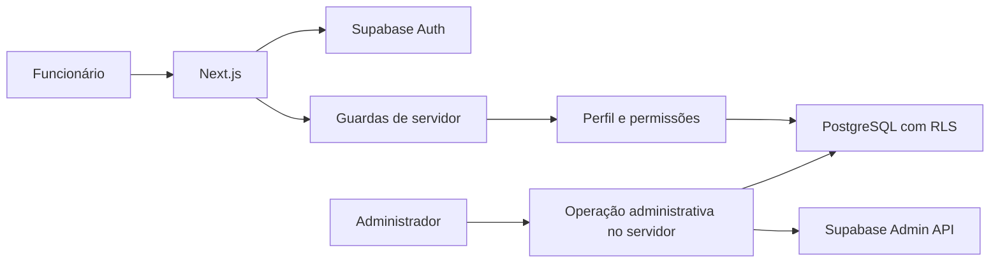

# Especificação de design — Autenticação e perfis

Data: 1º de setembro de 2026  
Status: desenho aprovado para planejamento  
Branch: `feature/autenticacao`

## 1. Objetivo

Integrar o sistema Mundo Ar Climatização ao Supabase para oferecer autenticação por e-mail e senha, recuperação de acesso, sessões seguras, proteção das áreas privadas e autorização pelos perfis administrador, atendente e técnico.

O módulo não terá cadastro público. O primeiro administrador será criado por um procedimento local documentado e, depois disso, somente administradores poderão convidar e gerenciar funcionários.

## 2. Abordagem escolhida

Será utilizado um projeto Supabase privado em nuvem, exclusivo para desenvolvimento e demonstração, com nome sugerido `mundo-ar-climatizacao-dev`.

Essa abordagem foi escolhida porque permite validar desde o início o Supabase Auth, o PostgreSQL e as políticas Row Level Security reais, reduzindo diferenças entre desenvolvimento e publicação. A alternativa de executar o Supabase localmente foi descartada nesta etapa por exigir Docker e aumentar o custo de configuração. A autenticação simulada foi descartada porque não validaria os requisitos de segurança e causaria retrabalho.

O esquema do banco será mantido por migrações SQL versionadas. Segredos, senhas e dados pessoais reais não serão incluídos no repositório.

## 3. Escopo

### 3.1 Incluído

- Criação e configuração do projeto Supabase de desenvolvimento.
- Autenticação por e-mail e senha.
- Renovação e encerramento da sessão.
- Recuperação de senha por link enviado por e-mail.
- Proteção das páginas e operações privadas.
- Perfis administrador, atendente e técnico.
- Bloqueio de contas inativas.
- Convite de funcionários pelo administrador.
- Consulta, ativação e inativação de contas pelo administrador.
- Políticas RLS e verificações de permissão no servidor.
- Procedimento seguro para criação do primeiro administrador.
- Testes automatizados do fluxo e das permissões.

### 3.2 Adiado

- Autenticação por telefone, redes sociais ou provedores corporativos.
- Autenticação multifator.
- Domínio e servidor SMTP definitivos da empresa.
- Auditoria detalhada das ações administrativas, além dos registros essenciais do Supabase e da aplicação.

### 3.3 Fora do escopo

- Cadastro público de usuários.
- Escolha ou visualização da senha de um funcionário pelo administrador.
- Armazenamento de senhas no banco da aplicação.

## 4. Atores e permissões

### 4.1 Administrador

- Acessa todas as áreas previstas nesta etapa.
- Convida novos funcionários informando nome, e-mail e perfil.
- Consulta as contas existentes.
- Ativa ou inativa contas.
- Não conhece nem define a senha dos funcionários.

### 4.2 Atendente

- Entra e sai do sistema.
- Recupera a própria senha.
- Acessa as áreas operacionais permitidas pelo sistema.
- Não administra usuários.

### 4.3 Técnico

- Entra e sai do sistema.
- Recupera a própria senha.
- Acessa somente as áreas técnicas permitidas pelo sistema.
- Não administra usuários.

Nesta etapa, a matriz central de permissões estabelecerá a base reutilizada pelos módulos seguintes. Toda autorização crítica será confirmada no servidor e no banco, independentemente da visibilidade dos controles na interface.

## 5. Modelo de dados

O Supabase Auth será responsável pelas credenciais e sessões. A aplicação manterá uma tabela pública de perfis vinculada a `auth.users`.

### 5.1 Enumeração de perfil

- `administrador`
- `atendente`
- `tecnico`

### 5.2 Tabela de perfis de usuários

| Campo | Finalidade |
| --- | --- |
| `id` | Identificador igual ao usuário de `auth.users` |
| `nome` | Nome de exibição do funcionário |
| `perfil` | Papel atribuído ao funcionário |
| `ativo` | Indica se a conta pode acessar o sistema |
| `criado_em` | Data e hora da criação |
| `atualizado_em` | Data e hora da última alteração |

A exclusão de contas não fará parte da interface. A inativação preservará o vínculo com registros históricos que serão criados nos módulos posteriores.

## 6. Arquitetura

### 6.1 Responsabilidades

- **Supabase Auth:** credenciais, convites, recuperação e ciclo da sessão.
- **Tabela de perfis:** nome, papel e situação da conta.
- **Camada de servidor do Next.js:** validação da sessão, autorização, operações administrativas e tratamento seguro de erros.
- **RLS:** última barreira de leitura e gravação no banco.
- **Interface:** formulários, mensagens, estados de carregamento e exibição de ações permitidas.

O navegador receberá somente a URL e a chave pública apropriada do Supabase. Qualquer credencial com privilégio administrativo permanecerá exclusivamente no servidor e fora do controle de versão.

## 7. Fluxos

### 7.1 Login

1. O funcionário informa e-mail e senha.
2. O Supabase valida as credenciais.
3. A sessão é armazenada e renovada por cookies seguros.
4. O servidor consulta o perfil e confirma que a conta está ativa.
5. O usuário é encaminhado ao dashboard.
6. Credenciais inválidas geram uma mensagem genérica que não revela se o e-mail existe.

### 7.2 Proteção de acesso

1. Uma requisição a uma área privada passa pela renovação da sessão.
2. A página ou operação de servidor valida o usuário autenticado.
3. A permissão necessária é comparada com o perfil ativo.
4. Ausência de sessão direciona ao login.
5. Falta de permissão direciona à tela de acesso negado ou retorna erro seguro em operações de servidor.
6. Conta inativa tem a sessão encerrada e o acesso bloqueado.

### 7.3 Convite de funcionário

1. Um administrador informa nome, e-mail e perfil.
2. O servidor valida os dados e confirma a permissão administrativa.
3. A operação administrativa do Supabase envia um convite ao funcionário.
4. O perfil correspondente é criado com os dados informados.
5. O funcionário abre o convite e define a própria senha.
6. Falhas parciais serão tratadas para não deixar uma conta utilizável sem um perfil válido.

### 7.4 Recuperação de senha

1. O funcionário informa o e-mail na página de recuperação.
2. O sistema sempre apresenta uma resposta neutra para evitar descoberta de contas.
3. O Supabase envia o link quando o endereço estiver cadastrado.
4. O funcionário abre o link e define uma nova senha.
5. Links inválidos ou expirados geram orientação para solicitar outro.

### 7.5 Logout

1. O funcionário aciona a opção de sair no cabeçalho.
2. A sessão é encerrada no Supabase.
3. Os cookies de autenticação são removidos.
4. O usuário retorna à página de login.

## 8. Rotas e interface

| Rota | Acesso | Finalidade |
| --- | --- | --- |
| `/login` | Público | Entrar com e-mail e senha |
| `/esqueci-senha` | Público | Solicitar link de recuperação |
| `/atualizar-senha` | Link autenticado de recuperação | Definir uma nova senha |
| `/acesso-negado` | Usuário autenticado | Informar falta de permissão |
| `/usuarios` | Administrador | Consultar e gerenciar funcionários |
| Área principal | Usuário autenticado e ativo | Exibir o sistema conforme as permissões |

Os formulários serão implementados com React Hook Form e Zod. Terão rótulos acessíveis, mensagens próximas aos campos, foco no primeiro erro, indicação de processamento e bloqueio de envio repetido. O visual seguirá o shell desktop-first já aprovado.

O cabeçalho exibirá nome, perfil e opção de encerrar a sessão. A navegação ocultará áreas não permitidas, mas essa ocultação não substituirá as validações no servidor e no banco.

## 9. Validação

- E-mail obrigatório, normalizado e validado.
- Senha obrigatória no login.
- Nova senha sujeita à política configurada no Supabase e confirmada no formulário.
- Nome obrigatório no convite.
- Perfil limitado aos três valores definidos.
- Conta nova ativa por padrão, salvo decisão explícita do administrador.
- Operações administrativas rejeitadas para atendente e técnico.
- Envios repetidos protegidos enquanto a operação estiver em andamento.

## 10. Tratamento de erros

- Login inválido não informará se o e-mail ou a senha foi o dado incorreto.
- Solicitação de recuperação responderá de forma neutra para e-mails existentes ou inexistentes.
- Conta inativa receberá mensagem clara de bloqueio, sem detalhes internos.
- Convite duplicado, link expirado e limite de tentativas terão mensagens específicas e orientações recuperáveis.
- Falhas de rede ou indisponibilidade preservarão dados não sensíveis digitados.
- Senhas serão limpas após falhas e nunca aparecerão em logs.
- Erros internos não exibirão tokens, chaves, consultas ou detalhes do provedor.
- Falhas na criação conjunta de usuário e perfil serão compensadas ou deixarão a conta bloqueada até a correção segura.

## 11. Configuração do Supabase

- Criar o projeto privado de desenvolvimento na conta do responsável pelo projeto.
- Selecionar a região adequada à oficina e à equipe de desenvolvimento.
- Registrar as URLs locais e futuras URLs publicadas permitidas para redirecionamento.
- Desabilitar o cadastro público na configuração da aplicação.
- Configurar os modelos de convite e recuperação em português quando possível.
- Usar o serviço de e-mail padrão somente durante o desenvolvimento, respeitando seus limites.
- Configurar SMTP próprio antes do uso real em produção.
- Manter URL, chave pública e credenciais exclusivas do servidor em variáveis de ambiente.
- Versionar tabelas, funções, restrições e políticas em `supabase/migrations`.

## 12. Estratégia de testes

### 12.1 Testes unitários

- Normalização e validação de e-mail.
- Validação de senha e confirmação.
- Validação do convite.
- Matriz de permissões.
- Rejeição de conta inativa.

### 12.2 Testes de componentes

- Login válido, inválido, em processamento e indisponível.
- Solicitação de recuperação com resposta neutra.
- Atualização de senha com link válido e inválido.
- Convite e alteração de situação de usuário.
- Navegação e mensagens acessíveis.

### 12.3 Testes de servidor e banco

- Redirecionamento sem sessão.
- Bloqueio de ação sem permissão.
- Políticas RLS com casos permitidos e negados.
- Bloqueio de perfil inativo.
- Ausência de credenciais administrativas no cliente.

### 12.4 Testes ponta a ponta

- Login e logout de cada perfil.
- Recuperação e atualização de senha.
- Convite de um funcionário pelo administrador.
- Bloqueio da administração de usuários para atendente e técnico.
- Bloqueio de uma conta inativada.

As contas automatizadas usarão variáveis protegidas. Nenhuma senha de teste será incluída no repositório.

## 13. Critérios de aceite

O módulo estará concluído quando:

1. O projeto Supabase de desenvolvimento estiver configurado sem segredos versionados.
2. O primeiro administrador puder ser criado por um procedimento documentado.
3. Usuários ativos dos três perfis puderem entrar e sair do sistema.
4. Áreas privadas rejeitarem usuários sem sessão.
5. Operações administrativas forem bloqueadas para atendente e técnico na interface, no servidor e no banco.
6. O administrador puder convidar, consultar, ativar e inativar funcionários.
7. Um funcionário puder solicitar e concluir a recuperação da própria senha.
8. Uma conta inativa não puder continuar usando o sistema.
9. Migrações e políticas permitirem reconstruir a estrutura do banco.
10. Lint, verificação de tipos, testes relevantes, build e teste de fumaça forem aprovados.

## 14. Evidências para o TCC

Esta etapa produzirá:

- descrição dos atores e permissões;
- casos de uso de login, recuperação e gerenciamento de usuários;
- modelo da tabela de perfis;
- scripts de migração e políticas RLS;
- capturas das telas finais;
- evidências dos testes positivos e negativos;
- registro das decisões de segurança adotadas.
